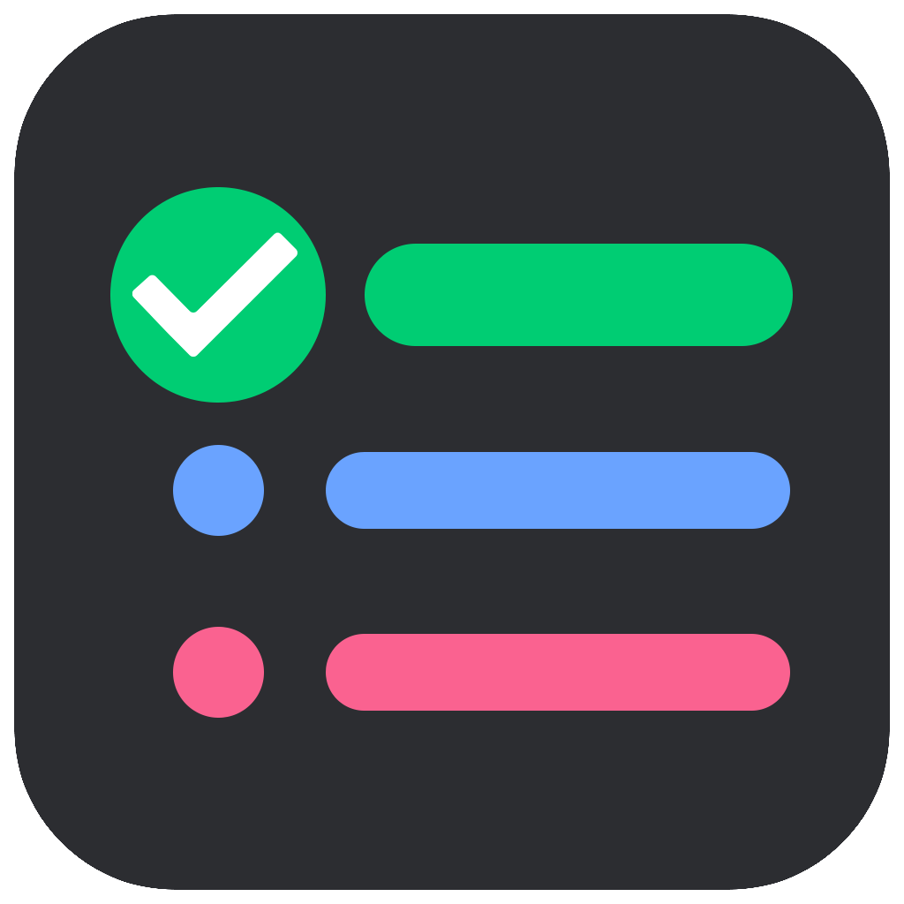

<!-- PROJECT LOGO -->
<div align="center">
  <a href="https://github.com/UlasGoktas/ToDoApp">
    
  </a>

  <h3 align="center">What To Do</h3>

  <p align="center">
    To Do List Task Manager.
    <br />
</div>

<!-- TABLE OF CONTENTS -->
<details>
  <summary>Table of Contents</summary>
  <ol>
    <li>
      <a href="#about-the-project">About The Project</a>
      <ul>
        <li><a href="#built-with">Built With</a></li>
      </ul>
    </li>
    <li>
      <a href="#getting-started">Getting Started</a>
      <ul>
        <li><a href="#prerequisites">Prerequisites</a></li>
        <li><a href="#installation">Installation</a></li>
      </ul>
    </li>
    <li><a href="#Screenshots">Screenshots</a></li>
    <li><a href="#license">License</a></li>
    <li><a href="#contact">Contact</a></li>
    <li><a href="#acknowledgments">Acknowledgments</a></li>
  </ol>
</details>

<!-- ABOUT THE PROJECT -->
## About The Project

<p align="right">(<a href="#top">back to top</a>)</p>

### Built With

* [Swift 5](https://swift.org/blog/swift-5-released/)
* [Core Data](https://developer.apple.com/documentation/coredata)
* [Cocoapods](https://cocoapods.org)
* [MVVM](https://en.wikipedia.org/wiki/Model–view–viewmodel)

<p align="right">(<a href="#top">back to top</a>)</p>

<!-- GETTING STARTED -->
## Getting Started

### Pods
* [SwiftLint](https://cocoapods.org/pods/SwiftLint)

### Prerequisites

* iOS 13.0+
* Xcode 11.0+
* Swift 5.0+
* Cocoapods

  ```sh
  sudo gem install cocoapods
  ```

### Installation

1. Clone the repo
   ```sh
   git clone https://github.com/UlasGoktas/ToDoApp.git
   ```
2. Install Pods
   ```sh
   pod install
   ```
3. Open Xcode workspace
   ```sh
   open ToDoApp.xcworkspace
   ```

<p align="right">(<a href="#top">back to top</a>)</p>

<!-- Screenshots -->
## Screenshots

### Dark Mode


### Light Mode


<!-- LICENSE -->
## License

<p align="right">(<a href="#top">back to top</a>)</p>

<!-- CONTACT -->
## Contact

Ugur Ulas Goktas - u.ulas.goktas@gmail.com

Project Link:
    [https://github.com/UlasGoktas/ToDoApp](https://github.com/UlasGoktas/ToDoApp)

<p align="right">(<a href="#top">back to top</a>)</p>

<!-- ACKNOWLEDGMENTS -->
## Acknowledgments

<p align="right">(<a href="#top">back to top</a>)</p>
